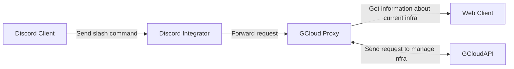

# Simple App Test
### Fade Rosyad

## Flowchart

## Tech Stack
1. Node Js for Discord Integrator base on 
2. Go for Gcloud Proxy base on
3. Terraform for provisioning Infrastructure
4. Google Cloud Platform
5. Kubernetes

