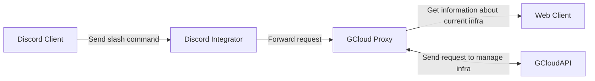

# Simple App Test
### Fade Rosyad

## About
This app purpose to enable possibility to send request from Messaging Application like discord to Google Cloud API

With this app anyboby on server / channel should be able to disable or enable infrastructure as part of cost reduction strategy

## Flowchart

## Tech Stack
1. Node Js for Discord Integrator
2. Go for Gcloud Proxy
3. Terraform for provisioning Infrastructure
4. Google Cloud Platform
5. Kubernetes

## Pipeline
For now pipeline triggered by changes on service folder and push on branch main

this could be improved for more environment like development, staging and production

## Things need to be improved
1. Fixed infrastructure on gcloud proxy. Can add parameter on request to send selection to what infrastructure that will be scaled
2. Discord client could show current condition of infrastructure before sending request
3. Database for recording activity that will shown on webpages
4. Flexible pipeline to accomodate deployment to multiple environment like development, staging and production
5. Exposing services to public and accessability

